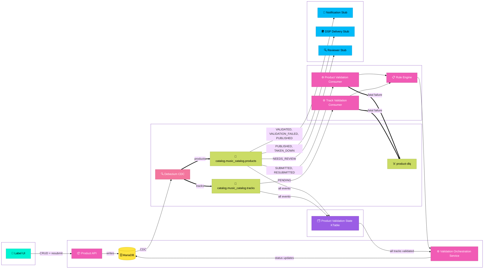

# Product Catalog Service

A take-home assignment for FUGA's Java Engineer position on the QC team. The brief asked for a backend service for a music product catalog.

## What I built

A Spring Boot service with two main responsibilities: a REST API supporting full CRUD operations on music products and tracks, and an event-driven validation pipeline that processes submissions asynchronously via Kafka.

Product-level validation and track validation run concurrently. A product waits in `AWAITING_TRACK_VALIDATION` until all its tracks pass -- only then does it move to `VALIDATED` and become eligible for DSP delivery.

## Architecture


## Key decisions

**Debezium for change capture**

Rather than publishing events explicitly from the application, I used Debezium to capture changes from MariaDB's binary log. This means the database is the source of truth and events flow from it naturally, so there's no risk of a write succeeding while the event publish fails. I've worked with this pattern before and it's one I trust.

**Keeping business logic out of the consumers**

Early on the consumers were doing too much: rule evaluation, status decisions, rollup logic. I pulled all of that into `ValidationOrchestrationService` so the consumers just deserialize, filter, and delegate. It made the logic much easier to test and reason about, and it means if we add another consumer later there's no temptation to duplicate the state machine.

**Rule engine behind a port**

The domain only knows about `ValidationOutcome`. It never sees `RuleResult` or `RuleSeverity`. I defined a `RuleEngine` port so the consumers depend on an interface, not on the infrastructure classes directly. The rule implementations can change without touching the domain.

**Kafka Streams KTable for submission state**

The tricky part of this problem is knowing when all tracks for a product have finished validating. My first instinct was to query MariaDB on every track event, but that gets chatty at scale. Instead I built a Kafka Streams application that merges the product and track event streams into a KTable keyed by product ID. The KTable holds the current validation state of each in-flight submission, and when it detects all tracks are validated it triggers the rollup.

The Kafka Streams app lives in the same service as everything else. I wouldn't do that in production. It should be a separate stateful deployment with persistent RocksDB volumes, but for this submission it keeps things self-contained.

## Running locally

Requires Docker and Java 21.
```bash
./init.sh
```

This builds the jar, starts all services, and registers the Debezium connector. The API is available at `http://localhost:8080` once the script completes.

## Running the tests
```bash
./mvnw test
```

Tests use Testcontainers and require Docker. To generate a coverage report:
```bash
./mvnw verify
open target/site/jacoco/index.html
```

## What I'd do differently with more time

**Extract the validation pipeline into its own service.** The product API and the validation pipeline have different operational requirements and should be separate services. The API is stateless and scales horizontally without ceremony. The validation pipeline (consumers, rule engine, and Kafka Streams application) is stateful, event-driven, and needs different scaling characteristics, particularly around the RocksDB state store. Keeping them together made sense for the submission but in production they would be separate deployments.

**Add a clean intermediate topic between Debezium and the consumers.** Right now the consumers parse the Debezium envelope directly. If we ever change CDC tooling, the consumers break. A thin translator producing to a stable domain event topic would decouple the two concerns properly.

**Expand DSP rule coverage.** The Spotify rules are a proof of concept. A real implementation would have rules per DSP with proper configuration, and the rule sets would likely be data-driven rather than hardcoded.